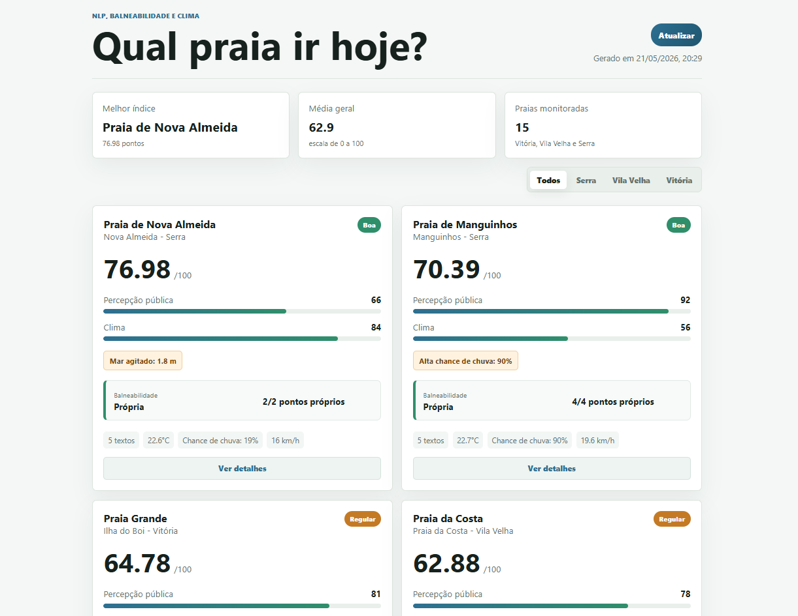

## O que o projeto faz

- Lê reviews/postagens de exemplo em `data/reviews.csv`.
- Usa NLTK para tokenizar texto em português e calcular sentimento com um léxico inicial customizável.
- Atualiza `data/bathing_points.csv` por web scraping quando fontes oficiais publicam pontos em HTML.
- Combina sentimento, avaliações numéricas e clima em um índice de 0 a 100, sinalizando pontos impróprios/interditados e descontando 15 pontos somente quando todos os pontos da praia estiverem ruins.
- Gera `data/latest_index.json`.
- Exibe o resultado em uma página web simples em `web/index.html`.

## Como rodar

1. Instale as dependências:

```powershell
python -m pip install -r requirements.txt
```

2. Gere o índice:

```powershell
python src/generate_index.py
```

3. Inicie o servidor local com a rota de atualização:

```powershell
python src/server.py
```

Depois acesse `http://localhost:8000/web/`.

Na interface, use o botão "Atualizar" para recalcular `data/latest_index.json` e atualizar os resultados exibidos.


## Aviso

Este é um projeto de estudo de tecnologia, feito para experimentar scraping, NLP, dados climáticos e visualização web. Ele não deve ser usado para tomada de decisões reais. Consulte sempre fontes oficiais e atualizadas.
